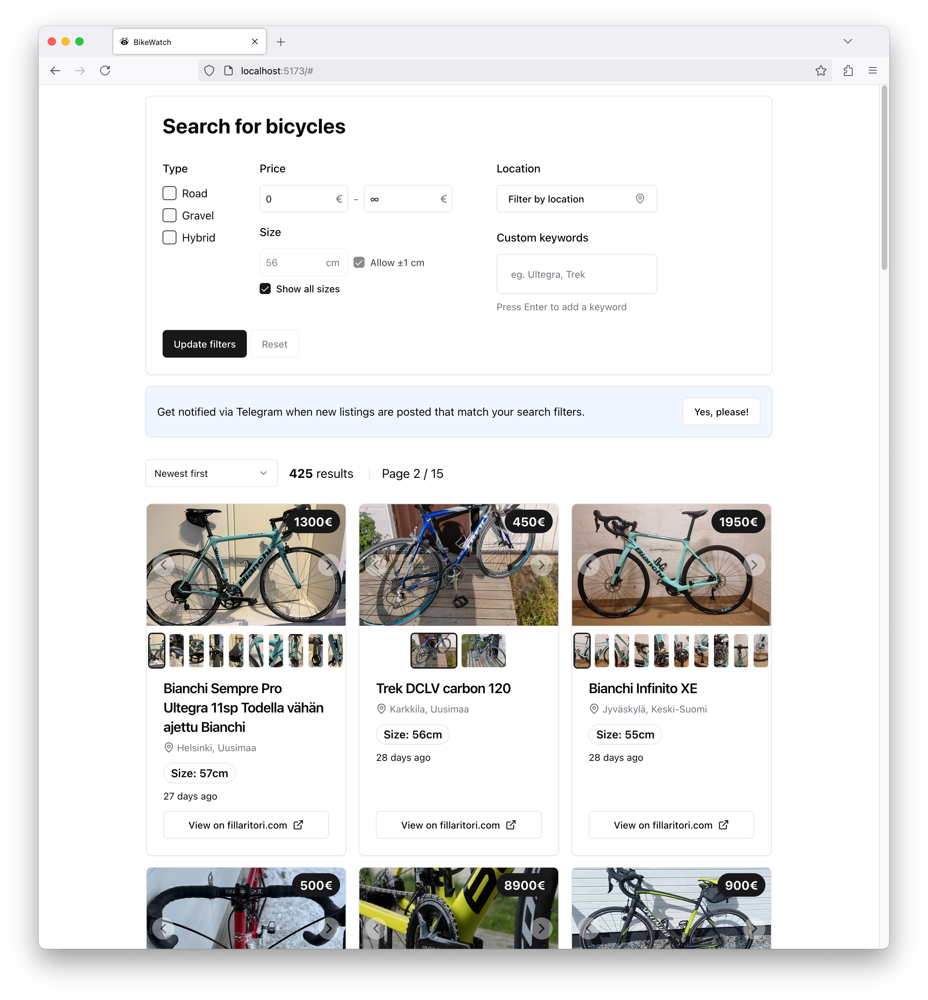

# BikeWatch

BikeWatch is service that monitors used bike listings on fillaritori.com and sends alerts to users via Telegram according to their selected search filters. 

# Features
-   Register filters with a Telegram bot to receive personalized notifications matching your filters
-   Browse all listings scraped from source websites and filter them by price, location, category and size
-   Register filters with a Telegram bot to receive personalized notifications matching your filters

## Demo

### Frontend

### Telegram Bot

## Getting started

-   Run the services using docker-compose:

`docker compose -f docker/docker-compose.yaml up --build`

## License

